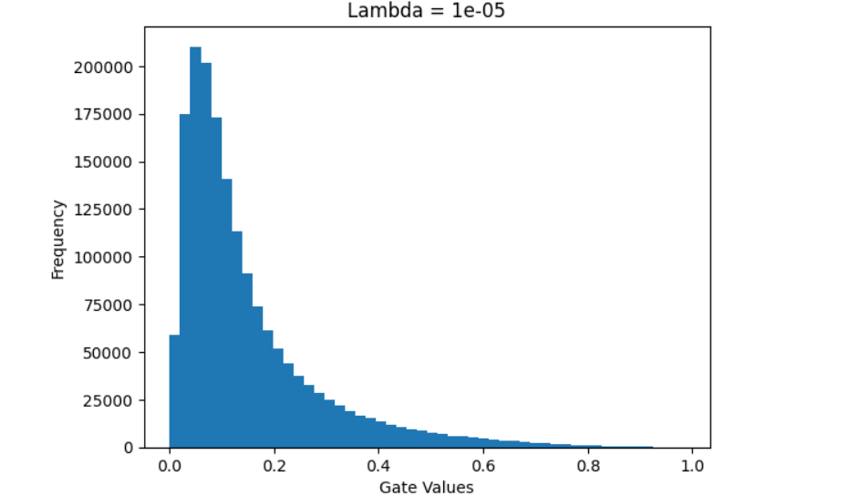
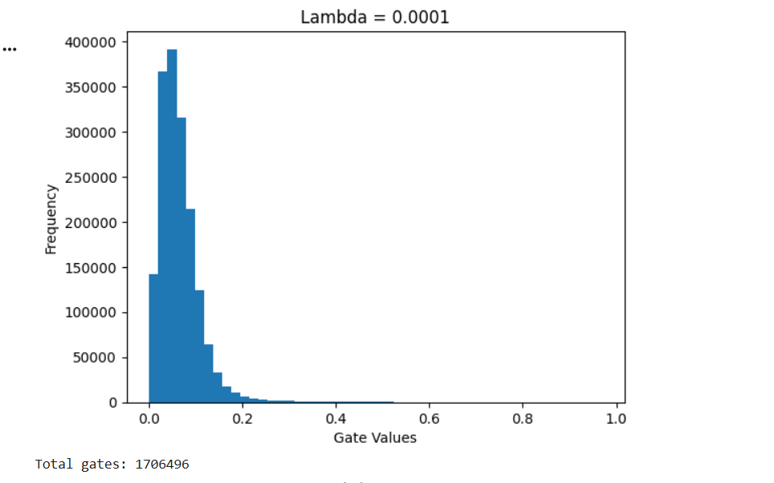
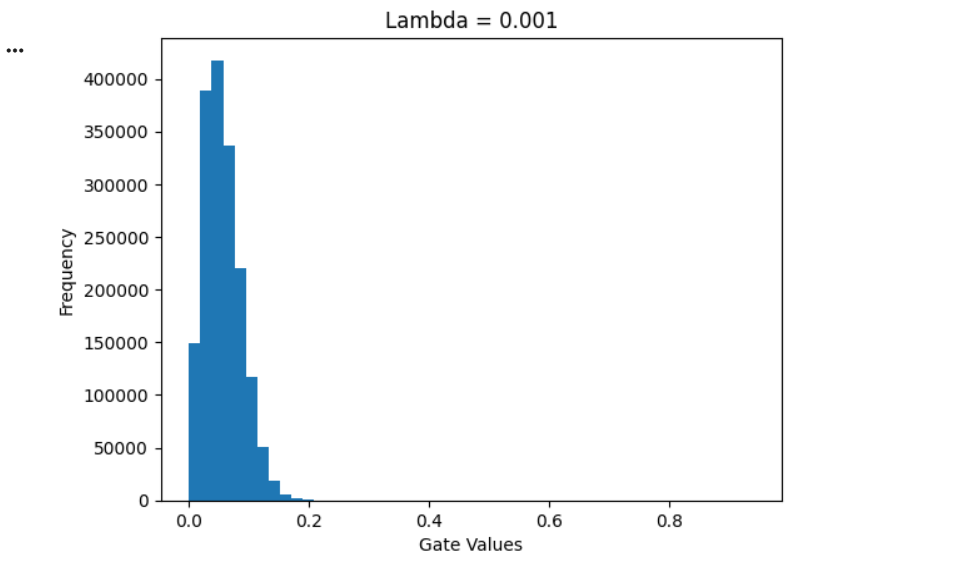

# 🧠 Self-Pruning Neural Network

## 📌 Overview
This project implements a neural network that **learns to prune its own weights during training** using a differentiable gating mechanism and L1 sparsity regularization.

Instead of pruning after training, the model dynamically removes unimportant connections while learning, resulting in a **compact and efficient network**.

---

## ⚙️ How It Works

Each weight is associated with a learnable gate:

- Gate ≈ 1 → weight is active  
- Gate ≈ 0 → weight is pruned  

### 🔹 Sparsity Loss
To encourage pruning, we use:

- L1 regularization pushes gate values toward **zero**
- Higher λ → more aggressive pruning

---

## 🚀 Features

- Custom `PrunableLinear` layer
- Learnable gating mechanism
- Differentiable pruning during training
- L1-based sparsity regularization
- CIFAR-10 dataset training
- Sparsity vs Accuracy analysis
- Visualization of gate distributions

---

## 📊 Results

| Lambda | Accuracy | Sparsity |
|--------|----------|----------|
| 1e-5   | 55%      | 0.28%    |
| 1e-4   | 53%      | 1.47%    |
| 1e-3   | 51%      | 1.70%    |

### 📌 Observations
- Increasing λ increases sparsity  
- Higher sparsity slightly reduces accuracy  
- Demonstrates the trade-off between **efficiency and performance**

---

## 📊 Gate Value Distribution

### 🔹 λ = 1e-5 (Low Sparsity)


- Wide distribution of gate values  
- Most weights remain active  
- Higher model capacity  

---

### 🔹 λ = 1e-4 (Moderate Sparsity)


- More gates shifting toward zero  
- Balanced pruning  

---

### 🔹 λ = 1e-3 (High Sparsity)


- Strong spike near zero  
- Majority of weights pruned  
- Compact model  

---

## ▶️ How to Run

### 1. Install dependencies
```bash
pip install torch torchvision matplotlib numpypython main.py
